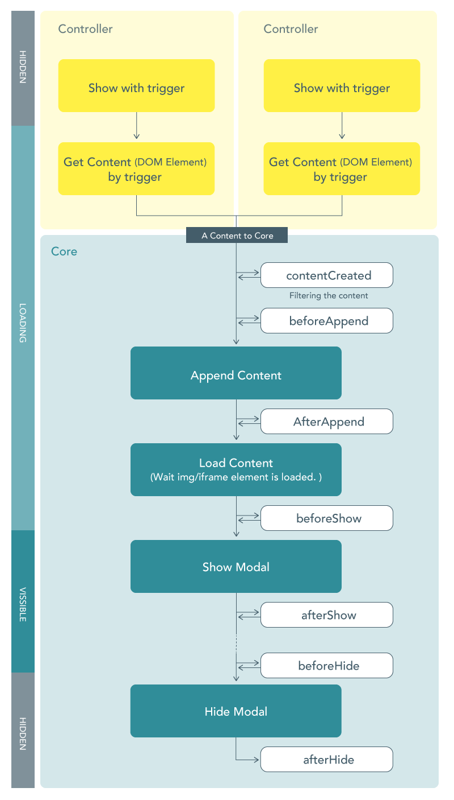

# Moodal

A pure JavaScript library for _modal dialog._

[](https://nodei.co/npm/moodal/)

## [](https://badge.fury.io/js/moodal)

## Get Started

### 1. Install

#### Install from NPM

```sh
npm install moodal --save
# or using yarn
yarn add moodal
```

```js
// import Moodal js
import Moodal from 'moodal';

// import required style
import 'moodal/lib/css/moodal-core.css';
```

#### Use CDN

```html
<script
  src="https://unpkg.com/moodal/lib/standalone/moodal.min.js"
  defer
></script>
<link
  rel="stylesheet"
  href="https://unpkg.com/moodal/lib/css/moodal-core.css"
/>
```

#### Use ES modules in browser.

```html
<script type="module" src="https://unpkg.com/moodal/lib/esm/index.mjs"></script>
<link
  rel="stylesheet"
  href="https://unpkg.com/moodal/lib/css/moodal-core.css"
/>
```

### 2. Add markup

- `[data-moodal-container]` element is requied. And this shoud be left empty. (will be rewrited innerHTML)
- `[data-moodal-close]` elements can be anywhere. The modal is close on it clicked.

```html
<div class="c-moodal" tabindex="-1" aria-hidden="true">
  <div class="c-moodal__bg"></div>
  <div class="c-moodal__loader">...Loading</div>
  <div class="c-moodal__container">
    <!-- close modal on `data-moodal-close` element clicked -->
    <div class="c-moodal__overlay" data-moodal-close></div>
    <div class="c-moodal__inner">
      <div class="c-moodal__body">
        <button class="c-moodal__close" type="button" data-moodal-close>
          Close
        </button>
        <div
          class="c-moodal__content"
          role="dialog"
          aria-modal="true"
          data-moodal-container
        >
          <!-- Will be appended content here -->
        </div>
      </div>
    </div>
  </div>
</div>
```

Minimum

```html
<div class="c-moodal" tabindex="-1" aria-hidden="true">
  <div class="c-moodal__container">
    <div class="c-moodal__inner">
      <div class="c-moodal__body">
        <div
          class="c-moodal__content"
          role="dialog"
          aria-modal="true"
          data-moodal-container
        ></div>
      </div>
    </div>
  </div>
</div>
```

### 3. Initialize Core

`new Moodal( wrapperElement: string|HTMLElement, <options>)`;

```js
// Init Core
const myModal = new Moodal('.c-moodal'); // selector or HTMLElement
```

```js
// Init Core with options
const myModal = new Moodal('.c-moodal', {
  noBackgroundScroll: true,
  backgroundElement: document.querySelector('.page-wrapper'),
  waitContentLoaded: true,
  stateClasses: {
    isVissible: 'is-vissible',
    isLoading: 'is-loading',
  },
});
```

### 4. Add Controller

`moodal.addController(<params>)`

- **Example 1:** Get content from DOM element in the page.

```html
<!-- controller -->
<button type="button" data-moodal-anchor="myContent">
  Show Modal of `myContent`
</button>
<!-- template for content -->
<template id="myContent" style="display:none;">
  <p>Lorem ipsum dolor sit amet, consectetur adipisicing elit,...</p>
</template>
```

```js
const modalCtrl = myModal.addController({
  controllerAttr: 'data-moodal-anchor',
  getContent: (trigger) => {
    // `trigger` is value of attribute `data-moodal-anchor`.
    const targetEl = document.getElementById(trigger);
    if (!targetEl) return;
    const content = document.createElement('div');
    content.innerHTML = targetEl.innerHTML;
    // Must return a HTMLElement
    return content;
  },
});

// You can show/hide modal by JavaScript
modalCtrl.show('myContent');
modalCtrl.hide();
```

- **Example 2:** Get content from page by fetch

```html
<!-- controller -->
<button data-moodal-ajax="target.html">Show Modal of `target.html`</button>
```

```js
const modalCtrlAjax = myModal.addController({
  controllerAttr: 'data-moodal-ajax',
  getContent: async (trigger) => {
    const response = await fetch(trigger, {
      method: 'GET',
    });
    const data = await response.text();
    const wrapper = document.createElement('div');
    wrapper.innerHTML = data;
    const content = wrapper.querySelector('article');
    if (!content) {
      throw new Error('No Content!');
    }
    return content;
  },
});
```

### 5. Styling

No theme styles is included in this library.  
You need to add the theme css yourself.


```css
.c-moodal__bg {
  background-color: rgba(0, 0, 0, 0.7);
}
.c-moodal__inner {
  padding-top: 60px;
  padding-bottom: 60px;
}
.c-moodal__body {
  border-radius: 6px;
  padding: 40px;
  background-color: #fff;
}
```

## Life cycle



---

## Core Params

| Param Name              | Type               | Default                     | Desc                                                                                                                                 |
| ----------------------- | ------------------ | --------------------------- | ------------------------------------------------------------------------------------------------------------------------------------ |
| containerSelector       | string             | "\[data-moodal-container\]" | Selector for the element appended content                                                                                            |
| hideOnClickSelector     | string             | "\[data-moodal-close\]"     | Selector for elements that close modal when clicked                                                                                  |
| noBackgroundScroll      | boolean            | false                       | if true, fix scrolling element                                                                                                       |
| backgroundElement       | HTMLElement        | undefined                   | The element you want to stop scrolling. ex. `document.querySelector(".page-wrapper")` <br>\* require if `noBackgroundScroll` is true |
| waitContentLoaded       | boolean            | true                        | if true, the modal is shown after `` or `<iframe>` element is loaded.                                                           |
| stateClasses            | Object             |                             | Classes for showing / loading state                                                                                                  |
| stateClasses.isVissible | string \| string[] | is-vissible                 | Class on showing modal                                                                                                               |
| stateClasses.isLoading  | string \| string[] | is-loading                  | Class on loading modal                                                                                                               |
| logLevel                | number             | 2                           | 0 = off, 1 = error, 2 = warning, 3 = info, 4 = debug                                                                                 |
| enableFocusTrap         | boolean            | true                        | Trap focus within a modal container on showing                                                                                       |
| hideByEscKey            | boolean            | true                        | Hide modadal using the ESC Key                                                                                                       |

## Controller Params

```js
myModal.addController({
  getContent: (trigger) => {
    // You must make content element form `trigger`
    // ...some code
    return content; // return HTMLElement
  },
  controllerAttr: 'data-modal-control',
});
```

| Param Name        | Type                                                       | Default                        | Desc                                                |
| ----------------- | ---------------------------------------------------------- | ------------------------------ | --------------------------------------------------- |
| getContent        | (trigger: string) => Promise\<HTMLElement\> \| HTMLElement | undefind **\* required**       | Get the content(HTMLElement) from `trigger` argment |
| controllerAttr    | string                                                     | ""                             | Data attribute name for button elements.            |
| waitContentLoaded | boolean                                                    | initialParam.waitContentLoaded | Overide the core option                             |
| manualShow        | boolean                                                    | false                          | if true, you need show the modal manualy            |

## Lifecycle Hooks

```js
myModal.addController({
    getContent: (target)=> {
        ...
    },
    beforeAppend: (context) => {
        // context argment is object  { content: HTMLElement, trigger:string }
        console.log('on before append:',context);
    },
    afterAppend: ({content,trigger}) => {
        // if this return `Promise`, proccess wait for resolve.
       return new Promise((resolve, rejects) => {
           console.log('content:',content,'trigger:',trigger);
            setTimeout(() => {
                console.log('1000ms later after appending');
                resolve();
            }, 1000);
        });
    }

})
```

### Hooks

| Hook Name    | Type                                  | Desc                              |
| ------------ | ------------------------------------- | --------------------------------- |
| beforeAppend | (context) => Promise\<void\> \| void; | Hook before appending the content |
| afterAppend  | (context) => Promise\<void\> \| void; | Hook after appending the content  |
| beforeShow   | (context) => Promise\<void\> \| void; | Hook before showing the modal     |
| afterShow    | (context) => Promise\<void\> \| void; | Hook after showing the modal      |
| beforeHide   | (context) => Promise\<void\> \| void; | Hook before hiding the modal      |
| afterHide    | (context) => Promise\<void\> \| void; | Hook after hiding the modal       |

### Filter

| Hook Name        | Type                                                                     | Desc                                                |
| ---------------- | ------------------------------------------------------------------------ | --------------------------------------------------- |
| contentCreated() | (content: HTMLElement) => HTMLElement \| Promise\<HTMLElement\> \| void; | Filtering the content before `beforeAppend` running |

---

## Browser support

Moodal is using Promose. [Can I use](https://caniuse.com/#feat=promises)  
If you need support legacy browser like IE11, use [polyfill](https://www.npmjs.com/package/promise-polyfill)

---

## License

[MIT](./LICENSE.txt)
